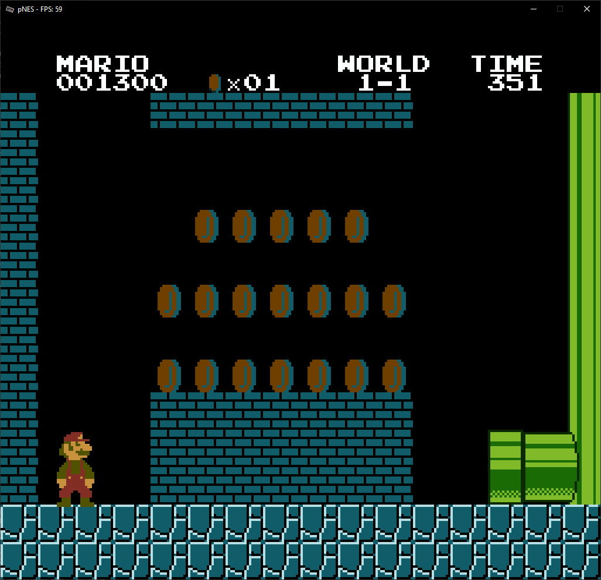

# pNES


pNES is a small NES emulator written in Rust that I have been working on.


## What works?
I'm mostly sure that the APU is generating the correct samples, but playing the audio doesn't seem to work.

Currently, only mapper 0 games are supported. Games that have been tested **working**:
- [x] Donkey Kong
- [x] Donkey Kong 3
- [x] Ice Climber
- [x] Mario Bros. (original)
- [x] Pac-Man
- [x] Super Mario Bros. (has some graphical bugs)

## How do I use this?
If you pass no arguments to the emulator, a file dialog will come up asking you to load an iNES rom.

Simply double click on any ``.nes`` file and if it's supported then it should run.

The console will show you any warnings/errors that happen during gameplay. These messages can mostly be disregarded.

If the emulator crashes, the panic message will tell you why it crashed. Please report it in the Issues tab on GitHub.

## How do I compile this?
First, you have to install python3. Then, run these commands:
```bat
rem Generate cycles.rs, opmatch.rs and trace.rs
python gen_op_funcs.py

rem Compile the emulator
cargo build --release
```

## Credits
https://bugzmanov.github.io/nes_ebook/chapter_1.html

https://github.com/starrhorne/nes-rust/tree/master/src/apu
